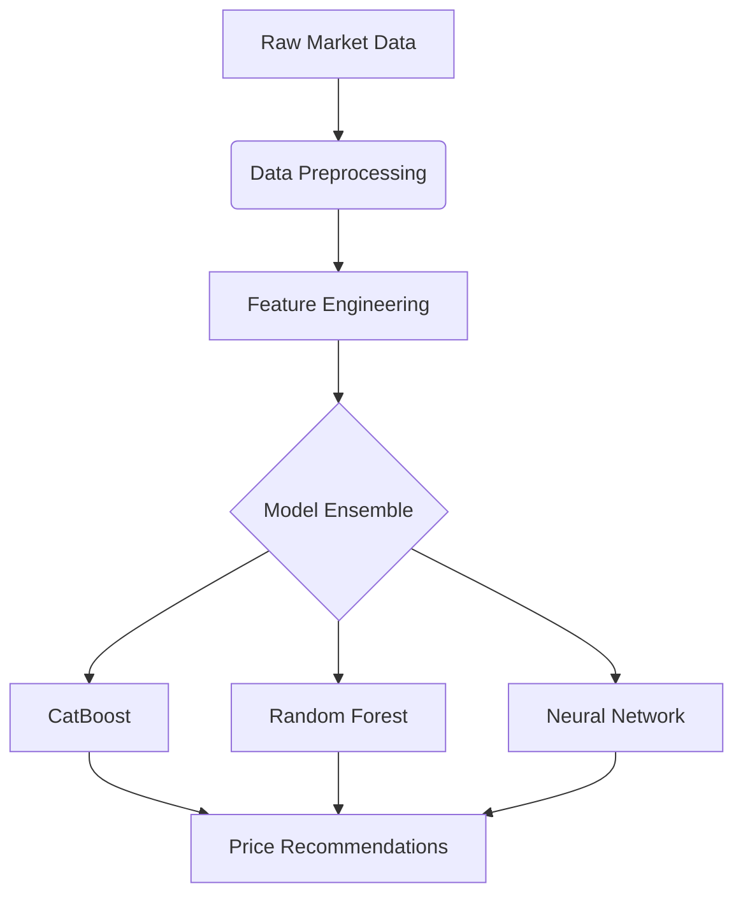

# 🚀 Dynamic Pricing Optimization Engine

  

## 📌 Table of Contents
- [Project Overview](#-project-overview)
- [Key Features](#-key-features)
- [Model Architecture](#-model-architecture)
- [Installation](#-installation)
- [Quick Start](#-quick-start)
- [Results](#-results)
- [Training Process](#-training-process)
- [API Usage](#-api-usage)
- [Contributing](#-contributing)
- [License](#-license)

## 🌟 Project Overview

An intelligent pricing system that leverages machine learning to optimize product pricing in real-time, balancing profitability and market competitiveness. The system combines:

- **Multi-model ensemble** (CatBoost, Random Forest, Neural Networks)
- **Market-sensitive features** (demand elasticity, competitor pricing)
- **MLflow-powered experiment tracking**
- **Production-ready Flask API**

## ✨ Key Features

| Feature | Description | Benefit |
|---------|-------------|---------|
| **Real-time Adaptation** | Adjusts prices based on live market data | Maximizes revenue opportunities |
| **Multi-model Ensemble** | Combines strengths of different algorithms | More robust predictions |
| **Explainable AI** | SHAP values for pricing decisions | Transparent business insights |
| **Automated Retraining** | Scheduled model refresh | Maintains prediction accuracy |

## 🏗 Model Architecture

